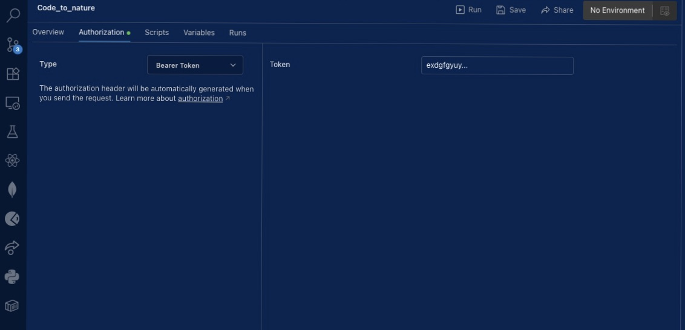

# Users App Documentation

## API Docs Tested With PostMan
***Signup user***
POST https://localhost/api/users/
body
{
    "email": "johndoe@example.com",
    "password": "test12345"
}
success: 201

***Login user***
POST https://localhost/api/token/
body
{
    "email": "johndoe@example.com",
    "password": "test12345"
}
response: {
    refresh: "....",
    access: "....",
}
copy access token and set postman authorization type to Bearer Token

success: 200

Note: Access token is required for all authenticated endpoints

***Get User(s)***
Make sure that access token is set in headers
GET https://localhost/api/users/
GET https://localhost/api/users/{id}/

***User Profile***
User Profile is created when user is first created
Make sure that access token is set in headers
GET https://localhost/api/profiles/
GET https://localhost/api/profiles/{id}/

***Edit Profile***
All fields
PUT https://localhost/api/profiles/{id}/
body
{
  "profile_pic": null,
  "github_username": "newgithubuser",
  "github_token": null,
  "eco_credits": 10,
  "locked_credits": 5,
  "current_streak": 2,
  "longest_streak": 7,
  "friends": []
}
success: 200

edit select fields
PATCH https://localhost/api/profiles/{id}/
body
{
  "github_username": "updatedgithub"
}
success: 200
